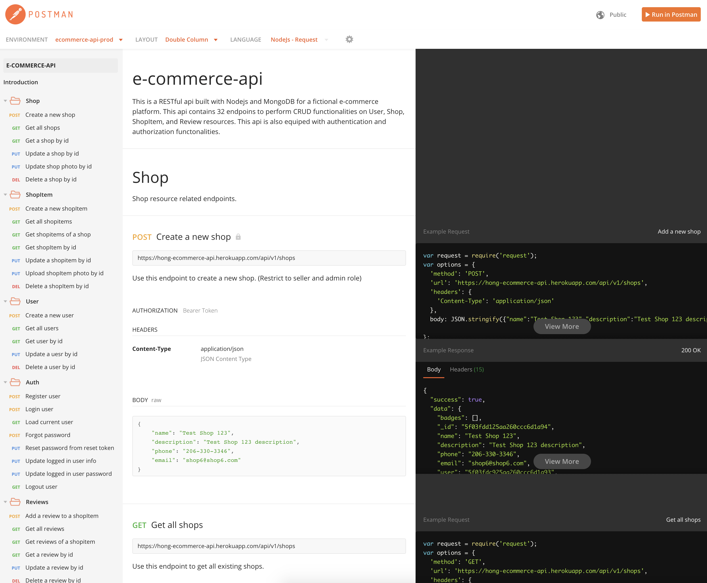
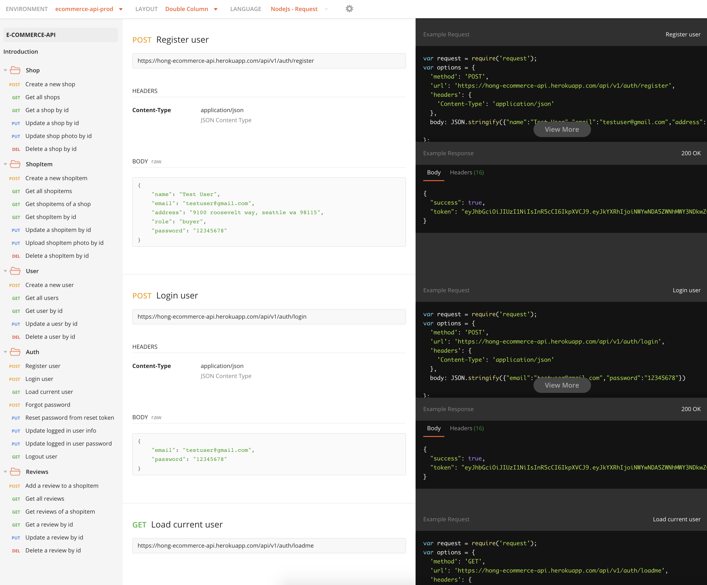

# REST api for e-commerce platform

#### This is a RESTful api built with Nodejs and MongoDB for a fictional e-commerce platform. This api contains 32 endpoins to perform CRUD functionalities on User, Shop, ShopItem, and Review resources. This api is also equiped with authentication and authorization functonalities.

[View full api doc please click here](https://documenter.getpostman.com/view/10852128/T17J86xf?version=latest)

## API DOC SNEAKPEAK:

